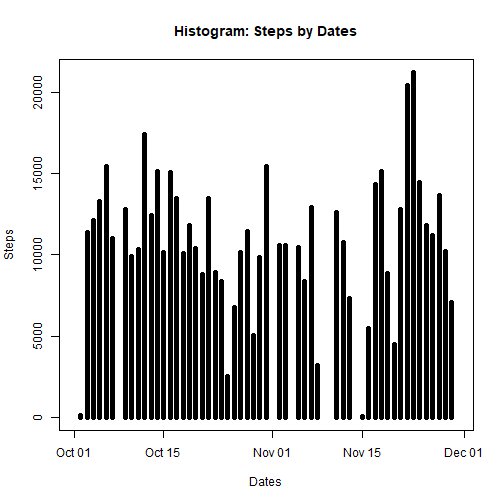
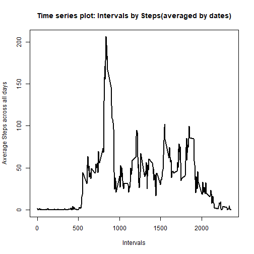
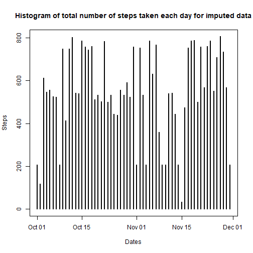
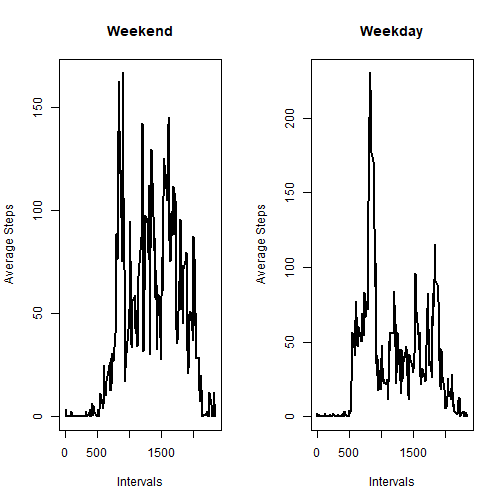

# Reproducible Research: Course Project 1
This assignment makes use of data from a personal activity monitoring device. This device collects data at 5 minute intervals through out the day. The data consists of two months of data from an anonymous individual collected during the months of October and November, 2012 and include the number of steps taken in 5 minute intervals each day.

### Loading and processing the data


```r
library(readr)
data <- read_csv('./repdata_data_activity/activity.csv', col_types = cols())
data
```

```
# A tibble: 17,568 x 3
   steps date       interval
   <dbl> <date>        <dbl>
 1    NA 2012-10-01        0
 2    NA 2012-10-01        5
 3    NA 2012-10-01       10
 4    NA 2012-10-01       15
 5    NA 2012-10-01       20
 6    NA 2012-10-01       25
 7    NA 2012-10-01       30
 8    NA 2012-10-01       35
 9    NA 2012-10-01       40
10    NA 2012-10-01       45
# ... with 17,558 more rows
```

### Histogram of the total number of steps taken each day


```r
library(dplyr, warn.conflicts = FALSE)
groupedByDate <- group_by(data, date)
total <- summarize_all(groupedByDate[,c(1:2)], sum)
plot(x = total$date, y = total$steps, type="h", lwd = "5", xlab = "Dates",
     ylab = "Steps", main = "Histogram: Steps by Dates")
```



### Mean and median number of steps taken each day


```r
summarize(groupedByDate, mean = mean(steps), median = median(steps))
```

```
# A tibble: 61 x 3
   date         mean median
   <date>      <dbl>  <dbl>
 1 2012-10-01 NA         NA
 2 2012-10-02  0.438      0
 3 2012-10-03 39.4        0
 4 2012-10-04 42.1        0
 5 2012-10-05 46.2        0
 6 2012-10-06 53.5        0
 7 2012-10-07 38.2        0
 8 2012-10-08 NA         NA
 9 2012-10-09 44.5        0
10 2012-10-10 34.4        0
# ... with 51 more rows
```

### Time series plot of the average number of steps taken, averaged across all days


```r
tsData <- group_by(data, interval) %>% summarize(avgSteps = mean(steps, na.rm = TRUE), .groups = "keep")
plot(x = tsData$interval, y = tsData$avgSteps, type = "l", lwd = 2,
     xlab = "Intervals", ylab = "Average Steps across all days",
     main = "Time series plot: Intervals by Steps(averaged by dates)")
```



### The 5-minute interval that, on average, contains the maximum number of steps


```r
filter(tsData, avgSteps == max(tsData$avgSteps))$interval
```

```
[1] 835
```

### Code to describe and show a strategy for imputing missing data


```r
missingVals <- complete.cases(data)
cat("The number of missing values are", sum(!missingVals), "\n")
```

```
The number of missing values are 2304 
```

Checking for dates that have some NAs and double values


```r
data.1 <- data[!missingVals,]
data.2 <- data[missingVals,]
cat("There are", length(unique(data.1$date)), "unique dates in data with NAs",
    "and",length(unique(data.2$date)), "unique dates in data without NAs.\n",
    "\nWe will check which dates from data with NAs exist in data without NAs\n",
    "\nOutput of 'unique(data.1$date) %in% unique(data.2$date)' gives us:\n\n",
    unique(data.1$date) %in% unique(data.2$date), 
    "\n\nWhich means that no single day/date has both NAs and numeric values when grouped by dates.")
```

```
There are 8 unique dates in data with NAs and 53 unique dates in data without NAs.
 
We will check which dates from data with NAs exist in data without NAs
 
Output of 'unique(data.1$date) %in% unique(data.2$date)' gives us:

 FALSE FALSE FALSE FALSE FALSE FALSE FALSE FALSE 

Which means that no single day/date has both NAs and numeric values when grouped by dates.
```

So, we'll impute the missing values based on average of 5 minute interval for all days.

```r
groupedByIntervals <- group_by(data, interval)
imputedData <- groupedByIntervals %>% summarise(mean = mean(steps, na.rm = TRUE)) %>%
  merge(data, ., all.x = TRUE) %>% mutate(steps = ifelse(is.na(steps)==TRUE, mean, steps)) %>% 
  select(-mean) %>% as_tibble() %>% arrange(date)
imputedData
```

```
# A tibble: 17,568 x 3
   interval  steps date      
      <dbl>  <dbl> <date>    
 1        0 1.72   2012-10-01
 2        5 0.340  2012-10-01
 3       10 0.132  2012-10-01
 4       15 0.151  2012-10-01
 5       20 0.0755 2012-10-01
 6       25 2.09   2012-10-01
 7       30 0.528  2012-10-01
 8       35 0.868  2012-10-01
 9       40 0      2012-10-01
10       45 1.47   2012-10-01
# ... with 17,558 more rows
```

### Histogram of the total number of steps taken each day after missing values are imputed


```r
plot(x = imputedData$date, y = imputedData$steps, type = "h", lwd = 2,
     xlab = "Dates", ylab = "Steps",
     main = "Histogram of total number of steps taken each day for imputed data")
```



Mean and median of imputed data


```r
gbd <- group_by(imputedData, date)
summarise(gbd, mean = mean(steps), median = median(steps))
```

```
# A tibble: 61 x 3
   date         mean median
   <date>      <dbl>  <dbl>
 1 2012-10-01 37.4     34.1
 2 2012-10-02  0.438    0  
 3 2012-10-03 39.4      0  
 4 2012-10-04 42.1      0  
 5 2012-10-05 46.2      0  
 6 2012-10-06 53.5      0  
 7 2012-10-07 38.2      0  
 8 2012-10-08 37.4     34.1
 9 2012-10-09 44.5      0  
10 2012-10-10 34.4      0  
# ... with 51 more rows
```

It can be seen from the data that the mean and median for non-impued days are still the same.
However, the mean and median for the imputed days have increased, increasing overall activity.

### Dataset with a coulmn "Day", indicating Weekend or Weekday


```r
l <- list(weekdays = c("Monday", "Tuesday", "Wednesday", "Thursday", "Friday"), weekends = c("Saturday", "Sunday"))
gbd <- mutate(gbd, day = ifelse(weekdays(date) %in% l$weekdays, "Weekday", "Weekend"))
gbd$day <- as.factor(gbd$day)
gbd
```

```
# A tibble: 17,568 x 4
# Groups:   date [61]
   interval  steps date       day    
      <dbl>  <dbl> <date>     <fct>  
 1        0 1.72   2012-10-01 Weekday
 2        5 0.340  2012-10-01 Weekday
 3       10 0.132  2012-10-01 Weekday
 4       15 0.151  2012-10-01 Weekday
 5       20 0.0755 2012-10-01 Weekday
 6       25 2.09   2012-10-01 Weekday
 7       30 0.528  2012-10-01 Weekday
 8       35 0.868  2012-10-01 Weekday
 9       40 0      2012-10-01 Weekday
10       45 1.47   2012-10-01 Weekday
# ... with 17,558 more rows
```

### Panel plot comparing the average number of steps taken per 5-minute interval across weekdays and weekends


```r
par(mfrow = c(1,2))
weekendData <- filter(gbd, day == "Weekend")
weekendData <- group_by(weekendData, interval)
weekendData <- summarise(weekendData, avg = mean(steps))

weekdayData <- filter(gbd, day == "Weekday")
weekdayData <- group_by(weekdayData, interval)
weekdayData <- summarise(weekdayData, avg = mean(steps))

plot(x = weekendData$interval, y = weekendData$avg, lwd = 2, xlab = "Intervals",
     ylab = "Average Steps", main = "Weekend", type = "l")
plot(x = weekdayData$interval, y = weekdayData$avg, lwd = 2, xlab = "Intervals",
     ylab = "Average Steps", main = "Weekday", type = "l")
```


